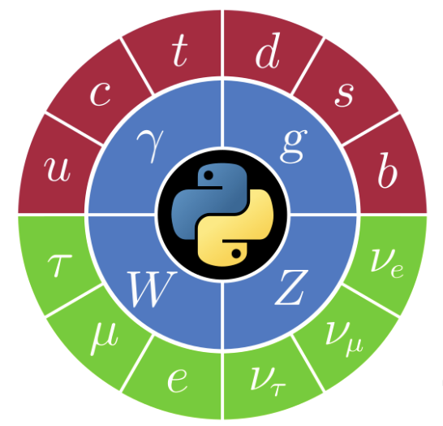

# PyHEP.dev 2024: Bridging Python and Julia for Enhanced Data Analysis

Let’s discuss the exciting world of combining Python and Julia for data analysis for high-energy physics (HEP) and other data-intensive fields.

We'll kick things off with a quick overview of why Python is so popular for data analysis and introduce Julia, which is making waves with its incredible performance and suitability for scientific computing.

Next, I'll show you how we can get the best of both worlds. We'll talk about using PythonCall to bring Python functions and libraries into Julia and how we can embed Julia code right into our Python scripts using JuliaCall. It's easier than you might think!

I'll walk you through some practical examples where mixing Python and Julia really shines. We'll look at real-world scenarios and see how this combination can speed up our data analysis and make our work more efficient.

Of course, there are always some bumps in the road, so I'll share some common challenges you might face and how to overcome them. We'll cover best practices for managing dependencies and keeping everything running smoothly.

Finally, we'll look ahead to the future. There's so much potential for deeper integration and community-driven innovation. I hope to inspire you to explore these possibilities and collaborate with other developers to push the boundaries of what's possible.

By the end of this talk, you'll have a good grasp of how to mix Python and Julia in your projects and leverage the strengths of both languages to supercharge your data analysis.

## Authors

- Ianna Osborne, Princeton University
- Jim Pivarski, Princeton University
- Jerry 🦑 Ling, Harvard University

## Acknowledgements

Support for this work was provided by NSF cooperative agreement [OAC-1836650](https://www.nsf.gov/awardsearch/showAward?AWD_ID=1836650) (IRIS-HEP)
